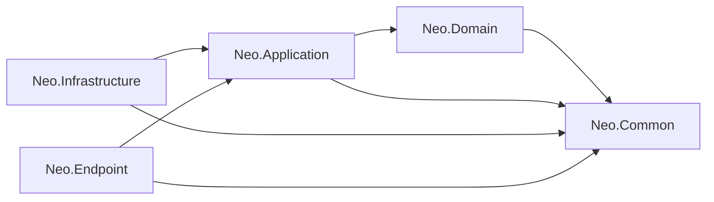

# Neo Framework

**Build .NET applications around your domain, with reusable CQRS, persistence and integration building blocks.**

[](https://dotnet.microsoft.com/download/dotnet/10.0)
[](LICENSE)

[Get started](#get-started) · [Architecture](#architecture) · [Build a feature](#build-a-feature) · [Integrations](#integrations) · [Contributing](#contributing)

Neo is a C# framework for applications organized around **Clean Architecture, CQRS and domain modeling**. It combines entity and repository contracts, MediatR request handling, EF Core implementations and ASP.NET Core endpoint support. Application code owns the business rules and chooses which infrastructure services to activate.

Created and maintained by [Javad Seyedi](https://github.com/SeyediDev).

## Why Neo?

- **A consistent feature structure.** Separate domain rules, application requests, storage implementations and HTTP delivery.
- **Reusable data access.** Command and query repositories share a unit-of-work contract, with EF Core implementations and support for different key types.
- **Less repetitive application code.** Generic CRUD handlers, validation behaviors and DTO mapping cover common workflows.
- **Integrations you can compose.** Use the available caching, identity, jobs, object storage and telemetry implementations as your application needs them.
- **Persian and multilingual support.** Utilities and culture-term services support applications with Persian-language requirements.

## Architecture

The source tree contains five library projects. Arrows below mean **project reference**, not request flow.



| Project | Responsibility | Start reading |
|---|---|---|
| `Neo.Common` | Shared attributes, extensions, utilities and low-level helpers | [Source](src/Neo.Common) |
| `Neo.Domain` | Entities, value objects, domain events, DTOs and service/repository contracts | [Entities](src/Neo.Domain/Entities/Base) · [Repositories](src/Neo.Domain/Repository) |
| `Neo.Application` | MediatR behaviors, generic feature handlers, Outbox and job orchestration | [Behaviors](src/Neo.Application/Behaviours/MediatR) · [Features](src/Neo.Application/Features) |
| `Neo.Infrastructure` | EF Core persistence and concrete integrations | [EF repositories](src/Neo.Infrastructure/Data/Repository/Ef) · [Integrations](src/Neo.Infrastructure/Features) |
| `Neo.Endpoint` | ASP.NET Core controllers, exception handling, API versioning, OpenAPI and monitoring | [Controllers](src/Neo.Endpoint/Controller) · [Registration](src/Neo.Endpoint/DependencyInjection.cs) |

Your application's API composes these libraries with its own domain, handlers, DbContexts and repository registrations. Referencing a library does not automatically configure external services.

## Get started

### Build from source

Install the **.NET 10 SDK** and Git, then run:

```bash
git clone https://github.com/SeyediDev/Neo-Framework.git
cd Neo-Framework
dotnet restore Neo.sln
dotnet build Neo.sln --no-restore
```

The target framework is defined in [Directory.Build.props](Directory.Build.props); dependency versions are managed in [Directory.Packages.props](Directory.Packages.props). This guide follows the source API. When consuming a published package, select an explicit available version and check its contracts against the source/tag for that version.

### Create your first domain object

From the repository root:

```bash
dotnet new console -n Neo.FirstFeature -o examples/Neo.FirstFeature --framework net10.0
dotnet add examples/Neo.FirstFeature/Neo.FirstFeature.csproj reference src/Neo.Domain/Neo.Domain.csproj
```

Replace `examples/Neo.FirstFeature/Program.cs` with:

```csharp
using Neo.Domain.Entities.Base;

var product = Product.Create("Keyboard", 49.90m);
Console.WriteLine($"{product.Name}: {product.Price:0.00}");

public sealed class Product : BaseEntity<Guid>
{
    public string Name { get; private set; } = string.Empty;
    public decimal Price { get; private set; }

    // Required by Neo's repository new() constraint.
    // Application code uses Create to enforce the business rules.
    public Product() { }

    public static Product Create(string name, decimal price)
    {
        ArgumentException.ThrowIfNullOrWhiteSpace(name);
        ArgumentOutOfRangeException.ThrowIfNegative(price);

        return new Product
        {
            Id = Guid.NewGuid(),
            Name = name.Trim(),
            Price = price
        };
    }
}
```

Run it:

```bash
dotnet run --project examples/Neo.FirstFeature/Neo.FirstFeature.csproj
```

This first step needs no database or identity provider. It introduces the entity base and keeps business invariants in the domain. The next step is to expose the operation through an application handler and persistence implementation.

## Build a feature

A typical create operation follows this path:

```text
HTTP endpoint → MediatR command → domain factory
             → command repository → unit of work → database
```

### Write through the command repository

For the `Product` above, an application handler can use the actual Neo contracts:

```csharp
using MediatR;
using Neo.Domain.Repository;

public sealed record CreateProduct(string Name, decimal Price) : IRequest<Guid>;

public sealed class CreateProductHandler(
    ICommandRepository<Product, Guid> repository)
    : IRequestHandler<CreateProduct, Guid>
{
    public async Task<Guid> Handle(
        CreateProduct request, CancellationToken cancellationToken)
    {
        var product = Product.Create(request.Name, request.Price);
        repository.Add(product);
        await repository.UnitOfWork.SaveChangesAsync(cancellationToken);
        return product.Id;
    }
}
```

This handler illustrates persistence; the host must also register input validation and map errors to its HTTP response contract. Use `IQueryRepository<Product, Guid>` for reads. The base `IRepository<TEntity, TKey>` exposes `Query()` and `UnitOfWork`; command operations belong to `ICommandRepository<TEntity, TKey>`.

For EF Core, derive your context from `EfDbContext<TContext>`, override `ContextAssembly`, and create concrete repositories derived from `EfCommandRepository<TEntity, TKey, TContext>` and `EfQueryRepository<TEntity, TKey, TContext>`. Register the context and both repository interfaces in your application. [See the repository integration examples](tests/Neo.Infrastructure.IntegrationTests/Data/Repository/EfRepositoryIntegrationTests.cs).

### Register the capabilities you use

These are the current entrypoints; this table describes their purpose and is not a complete application bootstrap.

| Extension | Namespace | Purpose |
|---|---|---|
| `AddNeoDomainServices(configuration)` | `Neo.Domain` | Multilingual and telemetry-related domain services |
| `AddNeoApplicationServices(configuration, assemblies)` | `Neo.Application` | Validators, MediatR behaviors, generic handlers, Outbox and job service registrations |
| `AddNeoInfrastructureServices(configuration, environment)` | `Neo.Infrastructure` | EF interceptor registrations and core infrastructure services |
| `AddNeoControllerServices(configuration, apiName)` | `Neo.Endpoint` | MVC/API versioning, exception handler registration, OpenAPI and monitoring services |

Pass the assemblies containing your application handlers to the application registration method. Supply your own repository implementations, configuration and any required integration dependencies. EF interceptors registered in DI must also be attached to the DbContext options to run.

For controller APIs, `AppControllerBase` exposes **`Sender`** for dispatching requests. `Result<T>` exposes **`Data`**, `Errors` and `ErrorMessage`, with factories such as `Result<Guid>.Success(id)`. Use the names from the actual source rather than examples written for a different revision.

### Validation and domain events

`ValidationBehaviour` executes FluentValidation validators and throws `Neo.Application.Exceptions.ValidationException`. `CustomExceptionHandler` maps that exception and several other known application exceptions to HTTP responses; activate ASP.NET Core's exception-handler middleware in the host.

`BaseEntity<TKey>.AddDomainEvent` records events in memory. When configured, `DispatchDomainEventsInterceptor` publishes them through MediatR during **SavingChanges**, before the database save completes. Use the Outbox workflow when durable message processing is required, and explicitly design the application's transaction boundary.

## Integrations

| Capability | Implementation in this repository | Application setup |
|---|---|---|
| Validation and mapping | FluentValidation behaviors and Mapster-based generic handlers | Register the assemblies, validators and mapping rules your feature uses |
| Persistence | EF Core context, command/query repositories, auditing and domain-event interceptors | Choose a provider; register context, repositories and interceptors |
| Caching | Memory, Redis and database-backed implementations | Select and configure the appropriate cache services |
| Background jobs | Hangfire integration and recurring-job abstractions | Configure storage and call the Hangfire registration method |
| Outbox and idempotency | Outbox processor/store, cache/Mongo idempotency stores and locking implementations | Provide repositories, scheduler, stores and transaction boundaries |
| Identity | Keycloak and development memory-provider implementations, JWT authentication setup | Configure the provider and the host's authentication/authorization policies |
| Object storage | MinIO implementation behind `IObjectStoreService` | Configure storage and register the implementation |
| Observability | OpenTelemetry/Serilog integrations, monitoring controllers and SignalR hub | Configure collectors, exporters and endpoint access |
| Localization | Culture-term services and Persian utilities | Supply the required term repository/data |

Hangfire lives inside **`Neo.Infrastructure`** in this source tree; there is no separate `Neo.Infrastructure.Hangfire` project here. The generic feature handlers use **Mapster**.

## Current behavior to understand

- `AuthorizationBehaviour` currently forwards requests; its permission-checking implementation is commented out. Its registration does not enforce command-level authorization. Apply the actual endpoint or application authorization mechanism your host requires.
- The memory identity provider contains development defaults. Use an explicitly configured identity provider for deployed applications.
- Outbox support is a set of composable services. Atomic persistence of business changes and messages depends on the unit of work and transaction configured by the consuming application.
- The checked-in build/release workflows currently select .NET 8 while the libraries target .NET 10. Align the workflows before relying on their build or release results.

## AI assistance and telemetry examples

[Neo Companion](tools/Neo.Companion/README.md) lives in this repository and includes feature/telemetry skills, a local C# MCP server, runnable examples and a dedicated GitHub Actions workflow. Its stdio server runs on the developer's computer and does not require hosted infrastructure.

Telemetry interception is active through `AddScopedWithTelemetry<IService, Implementation>()`. Resolve the interface to apply `[Telemetry]` on the interface or implementation method. The runtime preserves synchronous and asynchronous return shapes, propagates errors/cancellation, measures duration and isolates completion tags across concurrent calls. [See the runnable telemetry walkthrough](tools/Neo.Companion/docs/TELEMETRY.fa.md).

## Development and tests

```bash
dotnet test Neo.sln
```

Tests are organized by library under [tests](tests). To focus on persistence behavior:

```bash
dotnet test tests/Neo.Infrastructure.IntegrationTests/Neo.Infrastructure.IntegrationTests.csproj
```

Integration scenarios may require their own test configuration or services. A successful library build does not establish that every optional integration is configured or that all tests pass.

## Contributing

Issues with a minimal reproduction, documentation corrections and focused pull requests are welcome. Start with [CONTRIBUTING.md](CONTRIBUTING.md); for SDK requirements and API signatures, use the current project files and source.

When adding a feature, include a small executable example and tests for its externally visible behavior. Keep examples aligned with the source contracts so developers and coding assistants can build on them reliably.

## License

Neo is licensed under the [MIT License](LICENSE).
