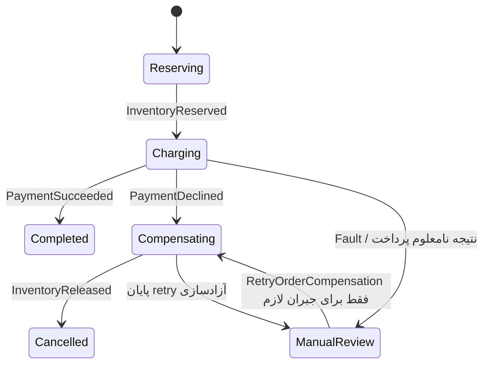

# Saga و Compensation در Neo

نمونهٔ Saga داخل [MessagingDemo](../samples/MessagingDemo) است؛ ابتدا [RabbitMQ را راه‌اندازی کنید](MESSAGING.fa.md). حالت `all` یا `worker`، state machine واقعی MassTransit را با repository حافظه‌ای و سه participant شبیه‌سازی‌شده ثبت می‌کند. پرداخت و انبار واقعی وجود ندارد. این نمونهٔ آموزشی، restart-safe یا آمادهٔ تولید نیست.

## جریان



Saga مراحل را هماهنگ و وضعیت را نگه می‌دارد؛ participantها عملیات را انجام می‌دهند. `OrderId` کلید correlation است. دستورهای ReserveInventory، ChargePayment و ReleaseInventory با **Send به صف مشخص** ارسال می‌شوند و پاسخ‌ها event هستند. نام صف‌ها از همان endpoint formatter ثبت‌شده به دست می‌آید تا تغییر prefix مسیر دستورها را خراب نکند.

Compensation یک عملیات کسب‌وکار جدید است: «آزادکردن رزرو» در برابر «رزرو موجودی». این کار تاریخچه را پاک نمی‌کند و rollback سراسری دیتابیس نیست. در جریان‌های طولانی‌تر، عملیات‌های قابل جبران را معمولاً از آخرین مرحلهٔ موفق به عقب انجام دهید؛ برای کارهای برگشت‌ناپذیر مانند ارسال کالا، مسیر انسانی یا فرایند جبرانی مستقل لازم است.

## تمرین‌های قابل اجرا

پس از اجرای نمونه روی 5087:

```powershell
$order = [guid]::NewGuid()
$body = @{ orderId = $order; declinePayment = $true; releaseFailures = 1 } | ConvertTo-Json
Invoke-RestMethod http://127.0.0.1:5087/sagas/orders -Method Post -ContentType application/json -Body $body
Invoke-RestMethod http://127.0.0.1:5087/sagas
Invoke-RestMethod http://127.0.0.1:5087/sagas/effects
```

انتظار: پرداخت رد می‌شود، آزادسازی بار اول timeout می‌دهد، retry بعدی موفق است و Saga به `Cancelled` می‌رود. در effects باید ReserveEffects=1 و ReleaseEffects=1 ببینید. پذیرش HTTP 202، تضمین اتمام Saga نیست؛ وضعیت را بعد از پردازش بخوانید.

برای هر تمرین OrderId جدید بسازید:

| ورودی | نتیجهٔ مورد انتظار |
|---|---|
| declinePayment=false | Completed؛ پرداخت شبیه‌سازی‌شده یک اثر دارد و رزرو باقی است |
| declinePayment=true، releaseFailures=0 | Cancelled؛ رزرو آزاد شده است |
| declinePayment=true، releaseFailures=1 | Cancelled پس از یک retry آزادسازی |
| declinePayment=true، releaseFailures=3 | ManualReview؛ سه تلاش (اولیه + دو retry) شکست خورده و رزرو باقی است |
| timeoutPayment=true | ManualReview؛ نتیجهٔ پرداخت نامعلوم است و رزرو خودکار آزاد نمی‌شود |

برای مورد شکست آزادسازی، پس از بررسی علت:

```powershell
Invoke-RestMethod "http://127.0.0.1:5087/sagas/orders/$order/retry-compensation" -Method Post
```

این فرمان محلی یک آزادسازی جدید بدون خطای ساختگی می‌فرستد و پس از دریافت تأیید به Cancelled می‌رسد. برای حالت timeout پرداخت کاری انجام نمی‌دهد: ابتدا باید نتیجهٔ واقعی پرداخت با provider تطبیق داده شود. endpoint اپراتوری نمونه authentication ندارد؛ نسخهٔ واقعی به مجوز، audit و دلیل اقدام نیاز دارد.

## تدابیر پیاده‌شده و مرز آن‌ها

- compensation تا دریافت InventoryReleased موفق محسوب نمی‌شود؛ شکست آن به ManualReview می‌رود.
- retry آزادسازی محدود به TimeoutException و دو تلاش مجدد است. پیام نهاییِ خطادار در RabbitMQ به صف error می‌رود و Fault برای Saga تولید می‌شود.
- عملیات شبیه‌سازی‌شده با OrderId ثابت idempotent است؛ آزادسازی دوباره، تعداد اثر را زیاد نمی‌کند. فرمان رزرو دیررس، رزرو قبلاً آزادشده را دوباره فعال نمی‌کند.
- Sagaهای terminal در حافظه باقی می‌مانند تا StartOrder تکراری فرایند تازه نسازد. در تولید retention و tombstone پایدار لازم است؛ نگهداری همیشگی همهٔ instanceها مناسب نیست.
- duplicateهای شناخته‌شده در state مناسب Ignore می‌شوند. پیام نامنتظر یا متناقض به معنی موفقیت تلقی نمی‌شود و ممکن است fault/error شود؛ مانیتور و reconcile لازم است.
- endpoint Saga برای سادگی یک پیام هم‌زمان پردازش می‌کند. این محدودیت جای concurrency control در دیتابیس و بین replicaها را نمی‌گیرد.
- InMemoryOutbox خروجی Saga را تا موفقیت consume بافر می‌کند؛ state، outbox و effects هنوز durable نیستند. همهٔ observations و ledgerها با restart پاک می‌شوند. تنها یک worker این نمونه را اجرا کنید؛ repository حافظه‌ای بین workerها مشترک نیست.

## برای استفادهٔ تولیدی چه چیزهایی لازم است؟

1. **State پایدار و concurrency:** repository دیتابیسی Saga، قید یکتای CorrelationId، migrations و کنترل optimistic/pessimistic مناسب دیتابیس. نمونه عمداً repository محصول شما را حدس نمی‌زند.
2. **Inbox/Outbox تراکنشی:** ذخیرهٔ state و پیام خروجی در تراکنش مشترک؛ در participantها effect و شناسهٔ عملیات را اتمیک ثبت کنید. عملیات خارجی به idempotency key provider نیاز دارد.
3. **Timeout واقعی:** نبودن پاسخ با exception دریافت‌شده یکسان نیست. نمونه scheduler و deadline خودکار ندارد و بدون پاسخ می‌تواند در state بماند. deadline پایدار، پیام timeout دارای شناسه/نسخهٔ مرحله و نادیده‌گرفتن timeoutهای قدیمی لازم است. یک job دوره‌ای Hangfire می‌تواند Sagaهای overdue را از دیتابیس پیدا و پیام reconciliation منتشر کند؛ تصمیم state transition داخل Saga بماند.
4. **نتیجهٔ نامعلوم پرداخت:** timeout به معنی رد پرداخت نیست. query/reconcile با provider، سپس تصمیم دربارهٔ ادامه، refund یا آزادسازی؛ هر refund هم idempotency و status مستقل می‌خواهد. retry کورکورانهٔ پرداخت ممکن است دوبار پول کم کند.
5. **Compensation شکست‌خورده:** attempt count، زمان تلاش بعدی، last error، alert و صف کار انسانی را نگه دارید. حالت Cancelled را فقط بعد از تأیید جبران ثبت کنید.
6. **قرارداد قابل ارتقا:** نسخه‌بندی پیام و سازگاری با Sagaهای در حال اجرا، correlation ثابت و شناسهٔ مستقل برای هر عملیات خارجی.

اگر فرایند شما صرفاً زنجیرهٔ jobهای داخلی است، Hangfire هنوز می‌تواند کافی باشد. Saga برای هماهنگی چند سرویس و تصمیم‌های مبتنی بر پیام مفید است. برای جریان متوالی با عملیات Execute/Compensate، Routing Slip/Courier گزینهٔ دیگری در MassTransit است؛ در این نسخه پیاده‌سازی State Machine را انتخاب کردیم چون وضعیت ManualReview و نتیجهٔ نامعلوم پرداخت را روشن‌تر نشان می‌دهد.

تست‌های `OrderSagaTests` state machine و consumerهای واقعی را روی transport حافظه‌ای اجرا می‌کنند؛ تست RabbitMQ در CI همان سناریوهای اصلی را با broker بررسی می‌کند. این تست‌ها تضمین crash recovery یا چند replica نیستند.

مرجع رسمی: [Saga state machine در MassTransit](https://masstransit.io/documentation/patterns/saga/state-machine). نمونه با API نسخهٔ 8.4.1 این ریپو ساخته می‌شود.

## ادامه با ذخیرهٔ پایدار

نسخهٔ دارای SQL Server، Bus/Consumer Outbox و Saga پایدار در [DurableMessagingDemo](../samples/DurableMessagingDemo/README.md) آمده است. برای مسیر Hangfire، [HangfireOutboxDemo](../samples/HangfireOutboxDemo/README.fa.md) را اجرا کنید. [راهنمای DDD و تحویل رویداد](EVENT-DELIVERY.fa.md) مرز تراکنش، بازیابی، پایش و مهاجرت را توضیح می‌دهد. نمونهٔ حافظه‌ای این راهنما همچنان مرحلهٔ مقدماتی آموزش است.
